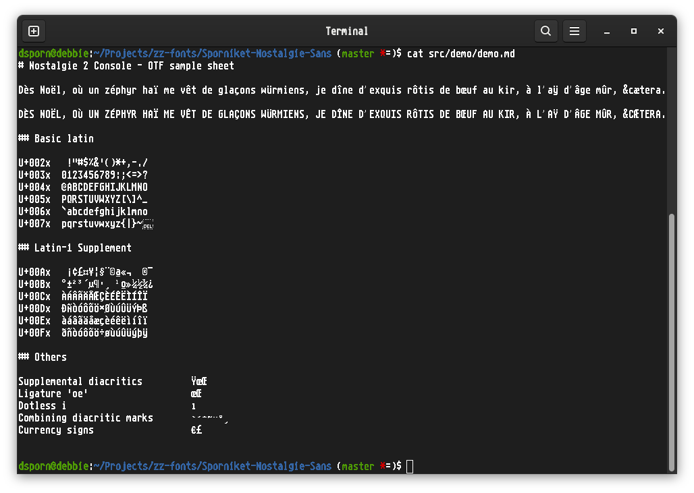
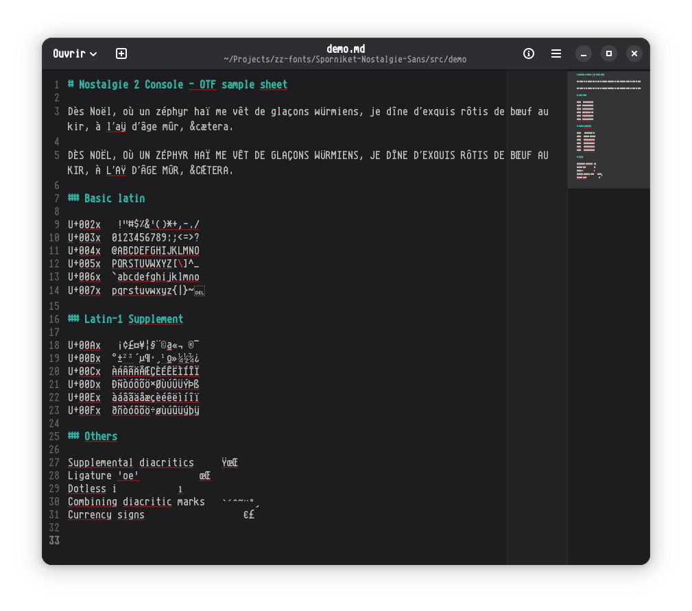

# Sporniket Nostalgie

> **2026-03-10** : The project has been re-organized, so that the _v1_ version of this project is archived in branch `v1-archive`. At the time of writing, the current project is the `v2` version, that has become the only version available on the main branch.

Content

1. What is **Sporniket Nostalgie**, and when to use it ?
2. What should you know before using **Sporniket Nostalgie** ?
3. How to use **Sporniket Nostalgie** ?
4. Known issues
5. Miscellanous

## 1. What is **Sporniket Nostalgie**, and when to use it ?

**Sporniket Nostalgie** is a collection of opentype fonts inspired by vintage computers from the 1980~2000 period. 

To date, the collection is made of

* _Sporniket Nostalgie 2 Console_ : inspired by the 8×16 pixels («high resolution») system font of the Atari ST.

### Gallery

#### Sporniket Nostalgie 2 Console

### What's new in v2.1.1

* _Sporniket Nostalgie 2 Console_ updated :
  * Euro sign has same width than regular glyphes, and the orientation of the cuts at the ends are like the regular euro sign.

### What's new in v2.1.0

* _Sporniket Nostalgie 2 Console_ updated :
  * Added euro sign
  * Added lira sign, updated sterling sign with same body as lira sign

### What's new in v2.0.0

* _Sporniket Nostalgie 2 Console_ added, renders like Atari ST 'hires' 8×16 font at 16 pixels height. Covers the following ranges :
  * US-ASCII a.k.a Basic latin (any printable character from code 32 —space— to 127).
  * Latin-1 supplement
  * 'oe' ligatures and Ÿ to support french.

### Licence

**Sporniket Nostalgie** is licenced under the [SIL OPEN FONT LICENSE Version 1.1 - 26 February 2007](http://scripts.sil.org/OFL).

## 2. What should you know before using **Sporniket Nostalgie** ?

**Sporniket Nostalgie** was made using [FontForge](https://fontforge.org/)

> Do not use **Sporniket Nostalgie** if this project is not suitable for your project

## 3. How to use **Sporniket Nostalgie** ?

### From source

> Required : fontforge and its python3 bindings

	git clone https://github.com/sporniket/Sporniket-Nostalgie-Sans.git
	cd Sporniket-Nostalgie-Sans
	./makeAll

The opentype fonts are generated into the `build` folder.

### Github releases

See the [releases page](https://github.com/sporniket/Sporniket-Nostalgie-Sans/releases)

## 4. Known issues

See the [project issues](https://github.com/sporniket/Sporniket-Nostalgie-Sans/issues) page.

## 5. Miscellanous

### Report issues

Use the [project issues](https://github.com/sporniket/Sporniket-Nostalgie-Sans/issues) page.

